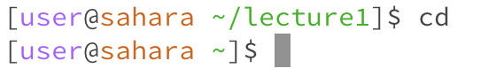
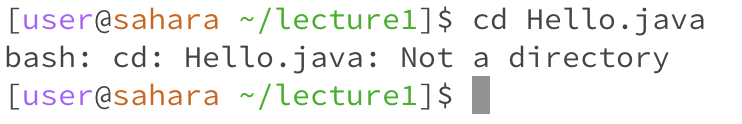
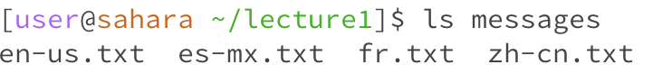
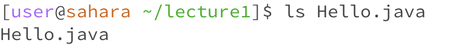
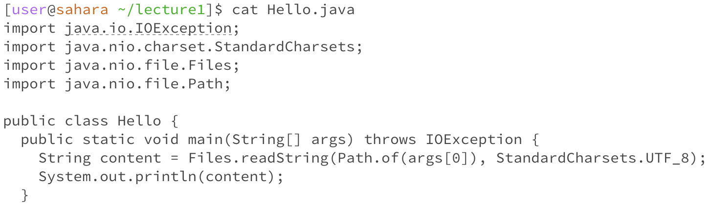
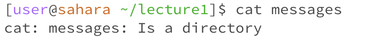

# Lab Report 1
## cd
1. Share an example of using the command with no arguments.
   

   working dir: lecture1

   When cd is used with no arguments, it changes the working directory to the home directory by default. No error occured.
   
3. Share an exmaple of using the command with a path to a directory as an argument.
   

   working dir: lecture1

   In this case, cd changed the working directory to the directory given as the argument, which was messages. No error occured.
   
5. Share an example of using the command with a path to a file as an argument.
   

   working dir: lecture1

   The argument for the command cd indicates the directory to be changed as the working directory, so it does not work with files as arguments and an error occurs.

## ls
1. Share an example of using the command with no arguments.
   

   working dir: lecture1

   When ls is used with no argument, it uses the working directory by default and displays the contents of the working directory, which was lecture1. No error occured.
   
2. Share an exmaple of using the command with a path to a directory as an argument.
   

   working dir: lecture1

   When a directory is given as an argument, ls displays the contents of that directory, which was messages in this case. No error occured.
   
3. Share an example of using the command with a path to a file as an argument.
   

   working dir: lecture1

   Because the argument was a file, the only file or directory to be displayed within that path was the file itself, so that was the only thing displayed. No error occured.

## cat
1. Share an example of using the command with no arguments.
   

   working dir: lecture1

   When cat is used with no arguments, it prompts the user to enter data from the standard input. No error occured.
   
3. Share an exmaple of using the command with a path to a directory as an argument.
   

   working dir: lecture1

   The command cat displays the text contents of a file, which in this case was Hello.java. No error occured.
   
5. Share an example of using the command with a path to a file as an argument.
   

   working dir: lecture1

   The command cat only displays text contents of files and does not work with directories, thus an error occurs when a directory is given as an argument.

   
