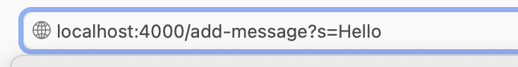
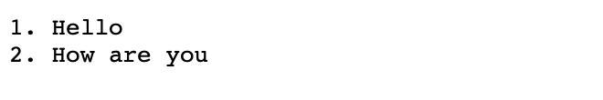

# Part 1

## 1. 

When I enter the url into my browser, the method handleRequest is called which takes the url as an argument. Before the method runs, the relevant fields are string which is empty and count which has a value of 0. When the method runs, it checks that the url contains the path "/add-message", and because it does, it increases the value of count from 0 to 1 and adds the count and the string given in the query of the url to string.
## 2. 

When I enter the second url into my browser, the method handleRequest is called again which takes the new url as an argument. Before the method runs, the relevant fields are string which contains "1. Hello", which is what was added from the previous call, and count which has a value of 1. When the method runs, it checks that the url contains the path "/add-message", and because it does, it increases the value of count from 1 to 2 and adds the current count and the string given in the query of the url to string.
