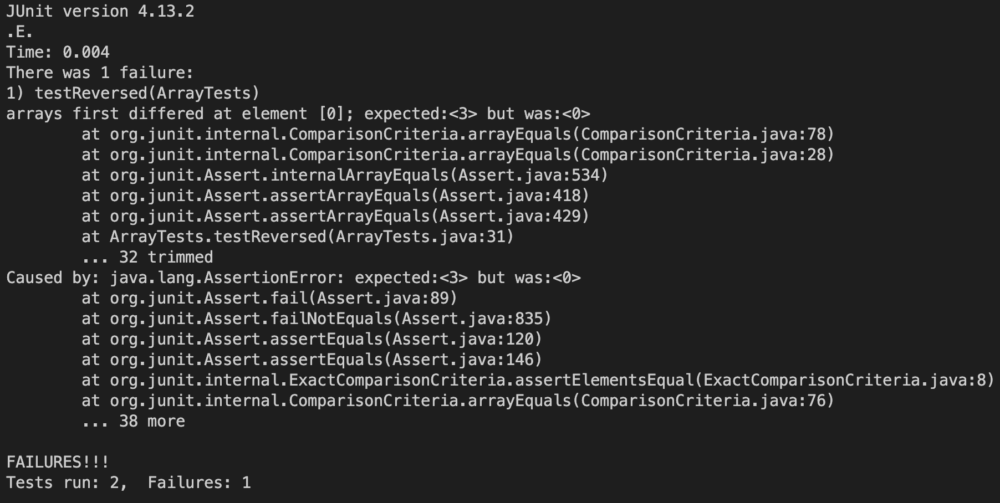

# Part 1
## A failure-inducing input:
```
  @Test
  public void testReversed() {
    int[] input = {1, 2, 3};
    assertArrayEquals(new int[]{3, 2, 1}, ArrayExamples.reversed(input));
  }
```
## An input that doesn’t induce a failure:
```
  @Test
  public void testReversed() {
    int[] input1 = { };
    assertArrayEquals(new int[]{ }, ArrayExamples.reversed(input1));
  }
```
## The symptom:


## The bug:
Before fix:
```
  static int[] reversed(int[] arr) {
    int[] newArray = new int[arr.length];
    for(int i = 0; i < arr.length; i += 1) {
      arr[i] = newArray[arr.length - i - 1];
    }
    return arr;
  }
```
After fix:
```
 static int[] reversed(int[] arr) {
    int[] newArray = new int[arr.length];
    for(int i = 0; i < arr.length; i += 1) {
      newArray[i] = arr[arr.length - i - 1];
    }
    return newArray;
  }
```
This fixes the bug because while before the values in the newly created blank array were being reversed and returned, after the fix the values from the original array are being reversed and returned.
## Part 2
# find
# -maxdepth (source: manual)
```
nicolehang@Nicoles-MacBook-Pro-3 docsearch % find technical -maxdepth 1 
technical
technical/government
technical/plos
technical/biomed
technical/911report
```
```
nicolehang@Nicoles-MacBook-Pro-3 docsearch % find technical/government -maxdepth 1
technical/government
technical/government/About_LSC
technical/government/Env_Prot_Agen
technical/government/Alcohol_Problems
technical/government/Gen_Account_Office
technical/government/Post_Rate_Comm
technical/government/Media
```
This option only searches as many levels deep as specified. It is helpful if you do not want to search too deep into the directory and only want to see files or directories that are a certain amount of levels in.
# -size (source: manual)
```
nicolehang@Nicoles-MacBook-Pro-3 docsearch % find technical -size -1000c 
technical
technical/government
technical/government/About_LSC
technical/government/Env_Prot_Agen
technical/government/Alcohol_Problems
technical/government/Post_Rate_Comm
technical/plos/pmed.0020191.txt
technical/plos/pmed.0020226.txt
technical/911report
```
```
nicolehang@Nicoles-MacBook-Pro-3 docsearch % find technical -size +200k
technical/government/About_LSC/commission_report.txt
technical/government/Env_Prot_Agen/bill.txt
technical/government/Gen_Account_Office/GovernmentAuditingStandards_yb2002ed.txt
technical/government/Gen_Account_Office/Statements_Feb28-1997_volume.txt
technical/government/Gen_Account_Office/d01591sp.txt
technical/911report/chapter-13.4.txt
technical/911report/chapter-13.5.txt
technical/911report/chapter-3.txt
```
This option returned directories or files that were less than or more than a certain size. This is helpful to narrow down the search to specific sizes.
# -amin (source: manual)
```
nicolehang@Nicoles-MacBook-Pro-3 docsearch % find technical/plos -amin -30
technical/plos/pmed.0020059.txt
technical/plos/pmed.0020073.txt
technical/plos/pmed.0020249.txt
technical/plos/pmed.0020103.txt
technical/plos/pmed.0010028.txt
technical/plos/pmed.0020018.txt
technical/plos/pmed.0020182.txt
technical/plos/pmed.0020246.txt
technical/plos/pmed.0020045.txt
technical/plos/pmed.0010036.txt
```
```
nicolehang@Nicoles-MacBook-Pro-3 docsearch % find technical/911report -amin +30
technical/911report
technical/911report/preface.txt
```
This option only returns directories or files that were accessed less than or more than a certain amount of minutes ago. This helps narrow down the search based on how recently files were accessed.
# -links (source: manual)
```
nicolehang@Nicoles-MacBook-Pro-3 docsearch % find technical -links +2
technical
technical/government
technical/government/About_LSC
technical/government/Env_Prot_Agen
technical/government/Alcohol_Problems
technical/government/Gen_Account_Office
technical/government/Post_Rate_Comm
technical/government/Media
technical/plos
technical/biomed
technical/911report
```
```
nicolehang@Nicoles-MacBook-Pro-3 docsearch % find technical/911report -links -2
technical/911report/chapter-13.4.txt
technical/911report/chapter-13.5.txt
technical/911report/chapter-13.1.txt
technical/911report/chapter-13.2.txt
technical/911report/chapter-13.3.txt
technical/911report/chapter-3.txt
technical/911report/chapter-2.txt
technical/911report/chapter-1.txt
technical/911report/chapter-5.txt
technical/911report/chapter-6.txt
technical/911report/chapter-7.txt
technical/911report/chapter-9.txt
technical/911report/chapter-8.txt
technical/911report/preface.txt
technical/911report/chapter-12.txt
technical/911report/chapter-10.txt
technical/911report/chapter-11.txt
```
This option helps narrow the search to files or directories that have more or less than a certain amount of links.
