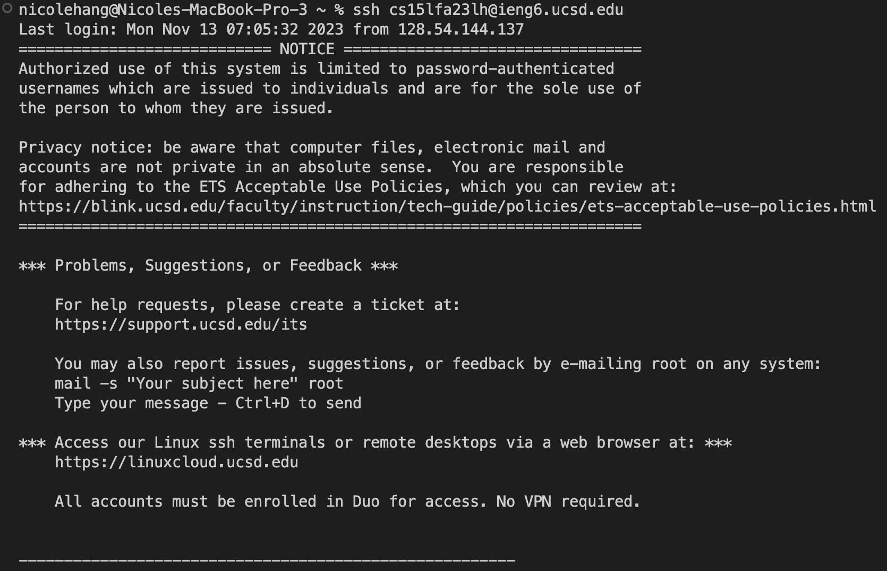
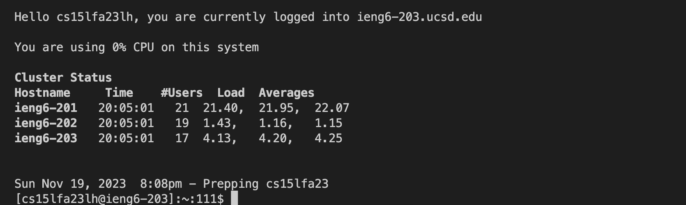
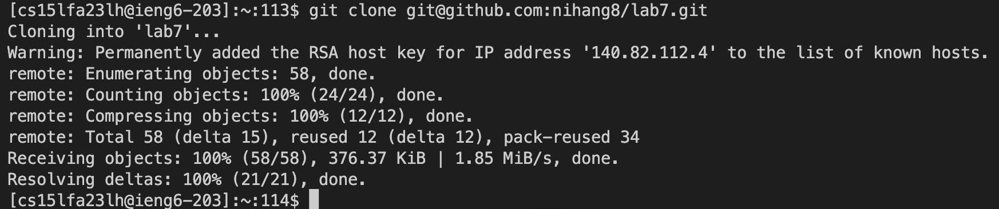
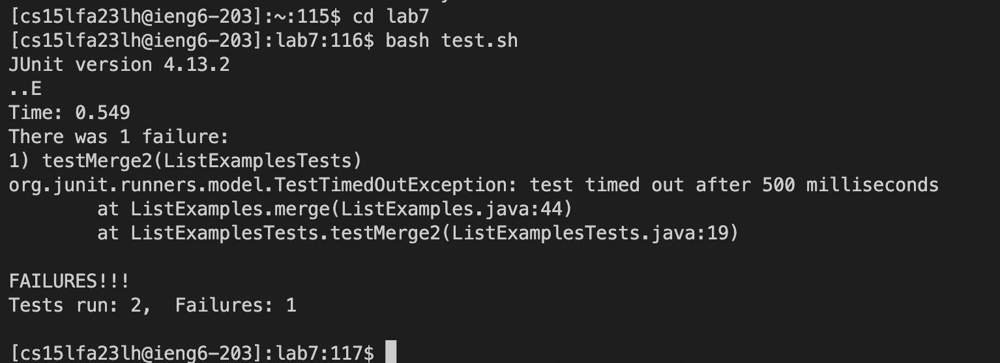
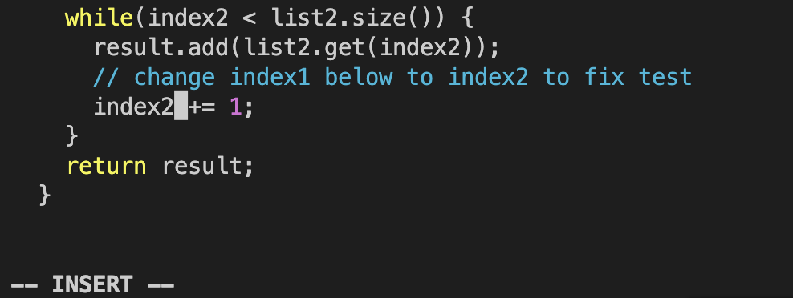
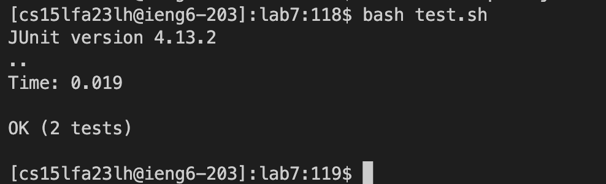
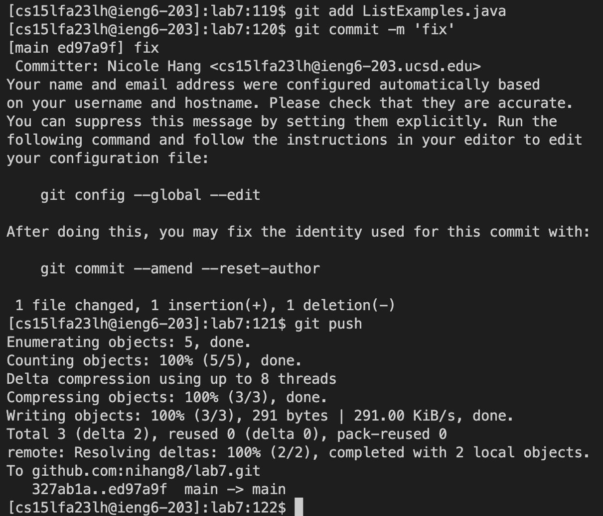

## 4.



Keys pressed: ```ssh cs15lfa23lh@ieng6.ucsd.edu<enter>```
I typed the command to login to my ieng6 account.

## 5.


Keys pressed: ```git clone <ctrl>v<enter>```
I used git clone and ctrl-v to paste the ssh url to clone the lab7 repository.

## 6.


Keys pressed: ```cd lab7<enter>``` ```bash test.sh<enter>```
I changed the directory to the lab7 repository directory then used bash to run the test file which showed 1 failure.

## 7.


Keys pressed: ```vim ListExamples.java<enter>``` ```43j``` ```e``` ```x``` ```i``` ```2``` ```<esc>``` ```:wq<enter>```
I used vim to edit the ListExamples.java file. I typed 43j then e to move to the specific place I wanted to edit then I used x to delete the 1 and entered insert mode using i to change the variable to index2. Then, I used escape to exit insert mode and :wq to save and quit.

## 8.


Keys pressed: ```bash test.sh<enter>```
I used bash to run the test file again which showed no failures meaning the code change was successful.

## 9.


Keys pressed: ```git add ListExamples.java<enter>``` ```git commit -m 'fix'<enter>``` ```git push<enter>```
I used git add to add the changes to ListExamples for the next commit. Then, I used git commit with -m to commit the changes with the message 'fix' and git push to push the changes to GitHub.
